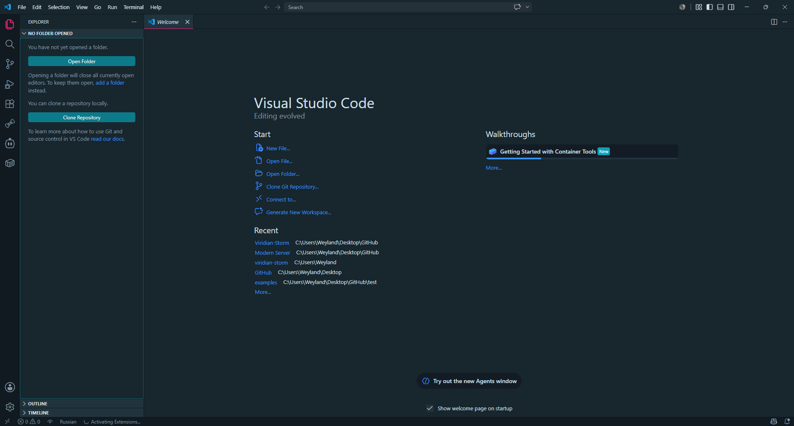
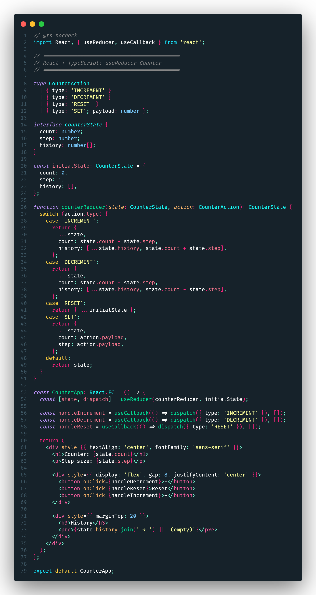
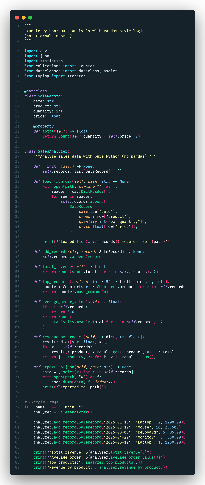
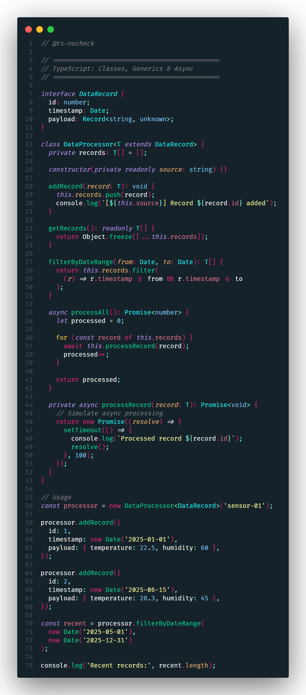
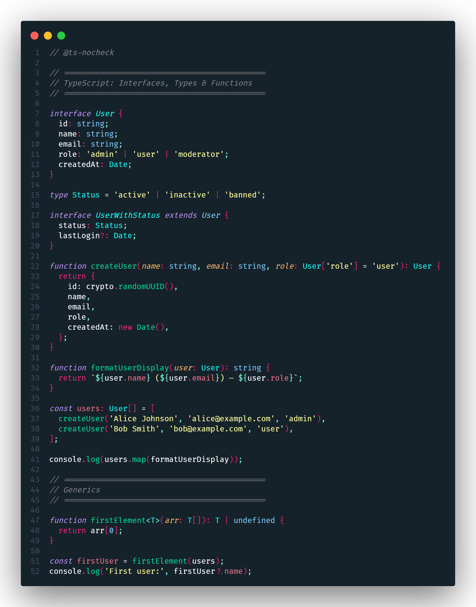
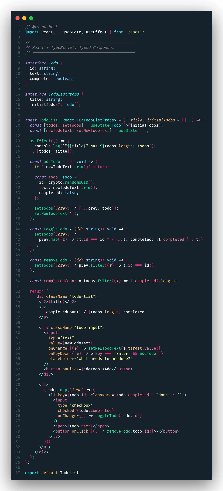
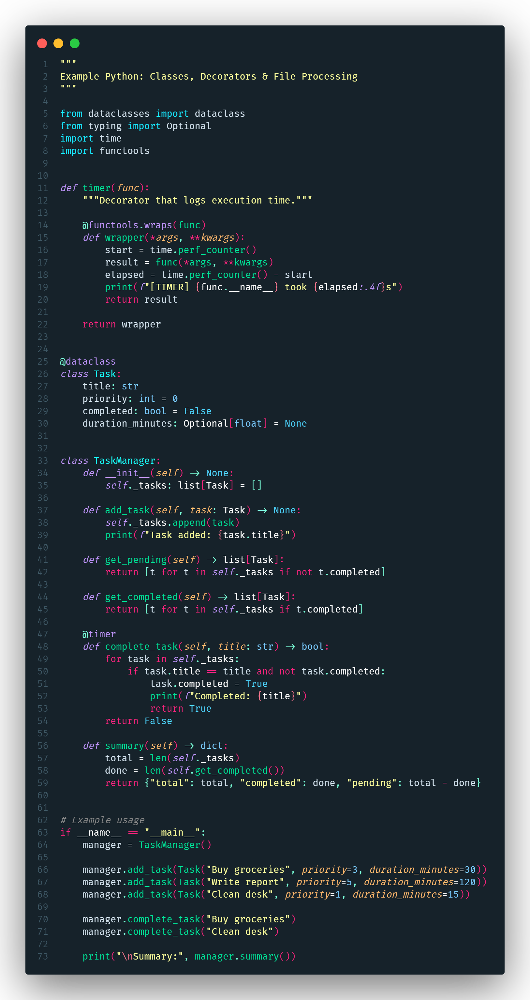

# Viridian Storm 🌩️

> *Dark teal depths meet neon violets, hot pinks, and acid yellows — built for those who code in the eye of the storm.*

A dark **Visual Studio Code** theme inspired by **Tokyo Night Storm** and **Dracula**. Deep teal backgrounds combined with vibrant neon accents — purple, hot pink, and acid yellow.

## 🎨 Color Palette

| Element | Color | Hex |
|---------|-------|-----|
| Editor Background | Dark Teal | `#16222a` |
| Foreground | Light Blue | `#d1e0eb` |
| Line Highlight | Dark Blue | `#1e3039` |
| Cursor | Light Blue | `#d1e0eb` |
| Selection | Blue | `#267ead55` |
| Line Numbers | Gray | `#3e5764` |
| Active Line Number | **Hot Pink** 🔥 | `#ff247f` |
| Brackets | Orange / Cyan / Green | `#FF5A00` / `#00E1FF` / `#10FF00` |
| Errors | Red | `#ff2f2f` |
| Warnings | Yellow | `#ffdd00` |

## 🚀 Installation

### From VS Code Marketplace

1. Open **Extensions** (`Ctrl+Shift+X`)
2. Search for **"Viridian Storm"**
3. Click **Install**
4. Open Command Palette (`Ctrl+Shift+P`) → `Preferences: Color Theme` → select **Viridian Storm**

### From .vsix file

1. Download `.vsix` from [Releases](https://github.com/Yuri-Weyland/Viridian-Storm/releases)
2. In VS Code: **Extensions** (`Ctrl+Shift+X`) → `...` → **Install from VSIX...**
3. Select the downloaded file

### From source

```bash
git clone https://github.com/Yuri-Weyland/Viridian-Storm.git
cd Viridian-Storm
npm install -g @vscode/vsce
vsce package
code --install-extension viridian-storm-*.vsix
```

## 📦 Packaging & Publishing

```bash
# Install vsce
npm install -g @vscode/vsce

# Package into .vsix
vsce package

# Publish to Marketplace
vsce publish
```

## 📄 License

MIT © [Yuri Weyland](https://github.com/Yuri-Weyland)

## 📸 Screenshots

### Editor Overview (no code)


### React + TypeScript: useReducer Counter


### Python: Data Analysis with Pandas-style logic


### TypeScript: Classes, Generics & Async


### TypeScript: Interfaces, Types & Functions


### React + TypeScript: Typed Component


### Python: Classes, Decorators & File Processing

